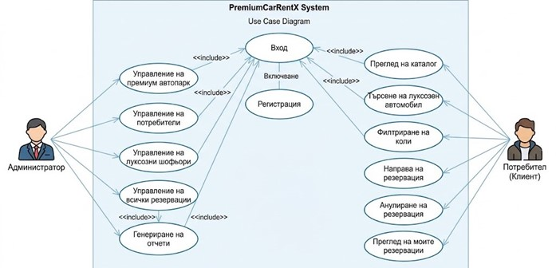

I. PremiumCarRentX - Car Rental Management System
PremiumCarRentX is a high-end web platform designed to streamline car rental operations. 
It provides a comprehensive solution for fleet management, personal driver services, 
and customer reservations, blending advanced functionality with a premium 
"Glassmorphism" visual design.

II. Key Features
Centralized Administration: Full CRUD operations for managing vehicles, 
professional drivers, and bookings.

Real-time Automation: Intelligent calculation of rental costs based on duration and 
additional services (e.g., personal driver).

Premium UI/UX: Responsive interface featuring modern Glassmorphism effects, 
optimized for all devices.

Role-Based Access Control (RBAC): Secure authentication and authorization using 
ASP.NET Core Identity with predefined roles: Admin, Client, and Driver.

Advanced Filtering: Dynamic catalog allowing users to filter cars by class, price, 
brand, and transmission type.

III. Technical Stack

Component					Technology
Framework					ASP.NET Core 9.0 MVC
Language					C#
Database					MS SQL Server
ORM							Entity Framework Core
Frontend					"HTML5, CSS3 (Custom Glassmorphism), JavaScript, Bootstrap"
Mapping & Security			"AutoMapper, ASP.NET Core Identity"
Testing						"NUnit, Moq"

IV. Architecture
The application follows the MVC (Model-View-Controller) architectural pattern to 
ensure separation of concerns:

Model: Handles data logic and business rules (Vehicles, Rentals, Users).

View: Renders the UI using Razor Pages.

Controller: Orchestrates user requests, processes logic, 
and communicates with the database.

System Logic & Use Cases
To visualize the interaction between the different user roles and the system's core features, please refer to the Use Case Diagram below:

*(Note: Diagram is in Bulgarian as part of the original diploma documentation)*

V. Testing
The project includes a robust suite of Unit Tests developed with NUnit and Moq,
ensuring system stability:

Controller Logic: Testing Admin, Cars, Rentals, and Home controllers.

Business Logic: Validation of price calculations and date-range overlaps
for reservations.

Mocking: Simulated dependencies for UserManager and database contexts to 
ensure isolated testing.

VI. Installation & Setup
1. Clone the repository:
git clone https://github.com/Kub4et0/PremiumCarRentX.git

2. Database Configuration:
Update the ConnectionStrings in appsettings.json to point to your local SQL Server
instance.

3. Apply Migrations:
Run the following command in the Package Manager Console:
Update-Database

4. Seeding Data:
On the first run, the DbSeeder class automatically creates roles and a default
Admin account:
Email: admin@rentacar.com
Password: Admin123!

VII. Author
Aleksandar Dimitrov Graduation Project 2026 School: PMG "Ivan Vazov" – Dimitrovgrad
Major: Applied Programmer